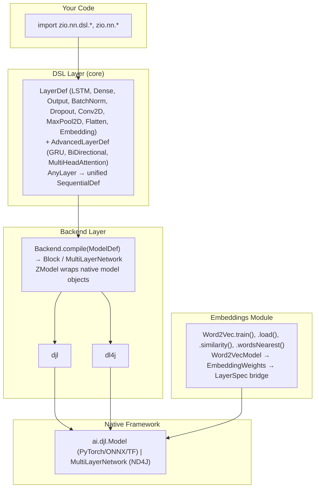

[← szekai.github.io](https://szekai.github.io/)

# zio-nn — Neural Network Library for ZIO

**Write once, run on any JVM deep learning framework. Swap the JAR, not the code.**

```scala
// Define architecture — same for both backends
import zio.nn.dsl.*
val arch = Sequential(7)(LSTM(64, Tanh), Dense(32, ReLU), Output(1, MSE)).build

// Create model — same for both backends
import zio.nn.dl4j.ZModel    // or zio.nn.djl.ZModel for DJL
import zio.nn.dl4j.Backend   // or zio.nn.djl.Backend for DJL
val model = ZModel.create(arch, "my-model").get

// Predict / Train — same for both backends
val predictions = model.predict(features).get      // Array[Array[Float]] → Array[Float]
model.fit(features, labels, epochs = 50)             // returns FitResult(loss, epochs)
model.close()
```

**Swap DJL ↔ DL4J by changing one line in `build.sbt` — zero code changes.**

📖 **[User Guide →](USER_GUIDE.md)** — architecture, DSL reference, escape hatches, backend swap guide.

## Modules

| Module | Description |
|--------|-------------|
| `zio-nn-core` | DSL (`dsl.*`), types (`ModelDef`, `LayerDef`, `FitResult`), ConfigLoader, implicits |
| `zio-nn-djl` | ZModel, Backend, zioApi, TensorOps, scope, implicits — PyTorch/ONNX/TF/XGBoost |
| `zio-nn-dl4j` | ZModel, Backend, zioApi, TensorOps, implicits — JVM-native (no Python) |
| `zio-nn-dl4j-embeddings` | Word2Vec training (`SequenceVectors + SkipGram`), pre-trained vector loading, embedding-to-LayerSpec bridge |
| `zio-nn-vectordb` | Vector store abstraction (`VectorStore` trait), `InMemoryVectorStore`, `PgvectorStore`, ZIO wrappers, egress pipeline (`predictAndStoreFlow`) |

```scala
// sbt — check latest release tag for version: https://github.com/szekai/zio-nn/releases
libraryDependencies += "io.github.szekai" %% "zio-nn-djl" % "<version>"  // or zio-nn-dl4j
```

## Quick Start

### 1. Define architecture

```scala
import zio.nn.dsl.*

val arch = Sequential(7)(
  LSTM(64, Tanh),
  Dense(32, ReLU),
  Output(1, MSE)
).withOptimizer(Adam(0.001)).build

// Or with custom seed
val arch2 = Sequential(10)(
  Dense(128, ReLU), Dropout(0.3), Dense(64, ReLU), Output(1, MSE)
).withSeed(99L).build
```

### 2. Create model

```scala
import zio.nn.dl4j.ZModel   // or zio.nn.djl.ZModel for DJL

val model = ZModel.create(arch, "my-model") match
  case Success(m) => m
  case Failure(e) => throw e
```

### 3. Train

```scala
val features: Array[Array[Float]] = // your training data
val labels: Array[Float]           = // your labels

model.fit(features, labels, epochs = 50, lr = 0.001f) match
  case Success(result) => println(s"Loss: ${result.loss}")
  case _ => println("Training failed")
```

### 4. Predict

```scala
model.predict(features) match
  case Success(result) => println(s"Predictions: ${result.mkString(",")}")
  case _ => println("Prediction failed")
```

### 5. Save / Load

```scala
model.save(Path.of("models/my-model"))
// Later...
val loaded = ZModel.load(Path.of("models/my-model"))
```

---

## DSL Reference

### Layer constructors

| DSL | Expands to |
|-----|-----------|
| `LSTM(64, Tanh)` | `LayerDef.LSTM(nIn=auto, nOut=64, Tanh)` |
| `LSTM(64)` | `LayerDef.LSTM(nIn=auto, nOut=64, Tanh)` (default) |
| `Dense(32, ReLU)` | `LayerDef.Dense(nIn=auto, nOut=32, ReLU)` |
| `Dense(32)` | `LayerDef.Dense(nIn=auto, nOut=32, ReLU)` (default) |
| `Output(1, MSE)` | `LayerDef.Output(nIn=auto, nOut=1, MSE)` |
| `Output(1)` | `LayerDef.Output(nIn=auto, nOut=1, MSE)` (default) |
| `BatchNorm` | `LayerDef.BatchNorm(nIn=auto)` |
| `Dropout(0.3)` | `LayerDef.Dropout(0.3)` |
| `Embedding(10000, 300)` | `LayerDef.Embedding(vocabSize=10000, embeddingDim=300)` |
| `LayerNorm` | `LayerDef.LayerNorm(nIn=auto)` |
| `TransformerEncoder(dim, heads, ffDim)` | `AdvancedLayerDef.TransformerEncoder(dim, numHeads, ffDim)` |
| `Conv2D(32, (3,3))` | `LayerDef.Conv2D(nIn=auto, filters=32, kernel=(3,3), ReLU)` |
| `MaxPool2D((2,2))` | `LayerDef.MaxPool2D(poolSize=(2,2))` |
| `Flatten` | `LayerDef.Flatten` |
| `GRU(64, Tanh)` | `AdvancedLayerDef.GRU(nIn=auto, nOut=64, Tanh)` (DJL only) |
| `BiDirectional(LSTM(64))` | `AdvancedLayerDef.BiDirectional(LSTM, nIn=auto, nOut=64, Tanh)` |
| `MultiHeadAttention(300, 8)` | `AdvancedLayerDef.MultiHeadAttention(embeddingDim=300, numHeads=8)` |
| `LayerNorm` | `LayerDef.LayerNorm(nIn=auto)` |
| `TransformerEncoder(512, 8, 2048)` | `AdvancedLayerDef.TransformerEncoder(dim=512, numHeads=8, ffDim=2048)` |

Input sizes auto-propagate through the chain: `Sequential(7)(LSTM(64), Dense(32), Output(1))` — the compiler resolves 7→64, 64→32, 32→1 automatically.

For embedding models, `Sequential(1)` starts with token-index input and the `Embedding` layer self-declares `vocabSize`/`embeddingDim`:

### Shortcuts

| Shortcut | Type |
|----------|------|
| `Tanh`, `ReLU`, `Sigmoid`, `Softmax` | `ActivationFn` |
| `MSE`, `MAE` | `LossFn` |
| `Adam(0.001)`, `SGD(0.01)`, `RMSprop(0.001)` | `OptimizerDef` |

### Builder chain

```scala
Sequential(7)(
  LSTM(64), Dense(32), Output(1)
).withOptimizer(SGD(0.01)).withSeed(42L).build
```

---

## Feature Coverage Matrix

### Unified API (same for both backends)

| Operation | Signature | Notes |
|-----------|-----------|-------|
| Create | `ZModel.create(arch, name)` | Compiles + initializes internally |
| Predict | `model.predict(features: Array[Array[Float]]): Try[Array[Float]]` | Internal NDList/INDArray conversion |
| Fit | `model.fit(features, labels, epochs, lr)` | Internal dataset creation |
| Save | `model.save(path)` | Framework-native format |
| Load | `ZModel.load(path)` | Auto-detects engine |
| Close | `model.close()` | Releases native resources |
| Tokenize | `tok.encode(text): Try[EncodingResult]` | Text → token IDs (see Tokenization section) |
| Image Transform | `transformer.transform(bytes): Try[Array[Array[Float]]]` | Raw image → float array (see Image Preprocessing section) |
| Evaluate | `model.evaluate(features, labels, metrics): Try[Map[String, Double]]` | Accuracy, precision, recall, F1 built-in |
| VectorStore | `store(record)`, `storeBatch(recs)`, `search(query, k)`, `delete(id)`, `deleteBatch(ids)` | Framework-agnostic, `ZIO.scoped` resource management |
| Predict & Store | `model.predictAndStore(features, store, ids): Try[Array[Float]]` | Predict + store result as `VectorRecord` in a `VectorStore` |
| predictAndStoreFlow | `ZPipeline[Any, Throwable, (Array[Array[Float]], Array[String]), Array[Float]]` | Streaming predict-and-store pipeline |
| Activation apply/derivative | `ActivationFn.ReLU.apply(x)` / `.derivative(x)` | Pure computation, no backend needed |
| Loss compute | `LossFn.MSE.compute(pred, actual)` | Pure computation, no backend needed |

### DSL Coverage (80% use case)

| Feature | DJL | DL4J |
|---------|-----|------|
| LSTM (recurrent) | ✅ | ✅ |
| Dense (fully-connected) | ✅ | ✅ |
| Output (regression/classification) | ✅ | ✅ |
| Batch Normalization | ✅ | ✅ |
| Dropout | ⚠️ identity | ✅ |
| Adam / SGD / RMSprop | ✅ | ✅ |
| Sequential models | ✅ | ✅ |
| Save / Load | ✅ | ✅ |
| Embedding | ✅ | ✅ |
| GRU | ✅ | ✅ |
| BiDirectional (LSTM/GRU) | ✅ | ✅ |
| MultiHeadAttention | ✅ | ✅ |
| LayerNorm | ✅ (native) | ❌ (DL4J 1.0.0-M2.1 lacks LayerNorm) |
| TransformerEncoder | ✅ (native block) | ❌ (use DJL or compose manually) |

### Tokenization

| Feature | DJL | DL4J |
|---------|-----|------|
| HuggingFace tokenizer (auto-download) | ✅ | — |
| Local `tokenizer.json` | ✅ | — |
| Regex tokenizer | — | ✅ |
| Whitespace tokenizer | — | ✅ |
| Batch encode | ✅ | ✅ |
| Decode (token IDs → text) | ✅ | ✅ |
| Attention mask | ✅ | — |
| Token type IDs | ✅ | — |
| ZIO wrappers (`encodeZ`, `decodeZ`) | ✅ | ✅ |

### Image Preprocessing

| Feature | DJL | DL4J |
|---------|-----|------|
| Resize | ✅ | ✅ |
| Normalize (mean/std) | ✅ | ✅ |
| CenterCrop | ✅ | ✅ |
| Pipeline composition (chained transforms) | ✅ | ✅ |

### GRU vs LSTM

GRU (Gated Recurrent Unit) is a simpler alternative to LSTM with fewer gates and no separate cell state:

**LSTM equations** (3 gates + cell state):

$$
\begin{aligned}
f_t &= \sigma(W_f \cdot [h_{t-1}, x_t] + b_f) &&\text{// forget gate} \\
i_t &= \sigma(W_i \cdot [h_{t-1}, x_t] + b_i) &&\text{// input gate} \\
o_t &= \sigma(W_o \cdot [h_{t-1}, x_t] + b_o) &&\text{// output gate} \\
\tilde{c}_t &= \tanh(W_c \cdot [h_{t-1}, x_t] + b_c) &&\text{// cell candidate} \\
c_t &= f_t \odot c_{t-1} + i_t \odot \tilde{c}_t &&\text{// cell state} \\
h_t &= o_t \odot \tanh(c_t) &&\text{// hidden state}
\end{aligned}
$$

**GRU equations** (2 gates, no cell state):

$$
\begin{aligned}
z_t &= \sigma(W_z \cdot [h_{t-1}, x_t] + b_z) &&\text{// update gate} \\
r_t &= \sigma(W_r \cdot [h_{t-1}, x_t] + b_r) &&\text{// reset gate} \\
\tilde{h}_t &= \tanh(W_h \cdot [r_t \odot h_{t-1}, x_t] + b_h) \\
h_t &= (1 - z_t) \odot h_{t-1} + z_t \odot \tilde{h}_t
\end{aligned}
$$

GRU has fewer parameters and often converges faster. Use GRU when you want faster training; use LSTM when you need the extra expressiveness of a separate cell state.

### Architecture Overview



### Escape Hatches (framework-specific)

| Feature | Access | Why not unified |
|---------|--------|-----------------|
| Multi-GPU | `model.underlying` → engine API | Different config per framework |
| Custom layers | `model.underlying.getBlock()` | Infinite possibilities |
| Distributed (Spark) | `model.underlying` (DL4J only) | DJL explicitly doesn't support |
| Model import | Raw `Model.newInstance()` | Different formats per framework |
| Fine-grained training | `model.predictorRaw()` / `model.trainerRaw()` | Custom loops |
| Conv2D, Transformers | Raw `Block` construction | Not yet in DSL |

---

## Implicit Conversions

Bridge between unified `Array[Float]` and native types when you need the escape hatch:

```scala
// DJL
import zio.nn.djl.implicits.*
// NDManager is managed internally by TensorOps and scope.withNDManager
val nd: NDList = myArrays.toNDList           // unified → native
val back: Array[Array[Float]] = nd.toFloatArrays  // native → unified

// DL4J
import zio.nn.dl4j.implicits.*
val ind: INDArray = myArrays.toINDArray       // unified → native
val back: Array[Float] = ind.toFloatArray     // native → unified
```

| Source | Method | Target | Backend |
|--------|--------|--------|---------|
| `Array[Array[Float]]` | `.toNDList` | `NDList` | DJL |
| `Array[Float]` | `.toNDArray` | `NDArray` | DJL |
| `NDList` | `.toFloatArrays` | `Array[Array[Float]]` | DJL |
| `NDArray` | `.toFloatArray` | `Array[Float]` | DJL |
| `Array[Array[Float]]` | `.toINDArray` | `INDArray` | DL4J |
| `Array[Float]` | `.toINDArray` | `INDArray` | DL4J |
| `INDArray` | `.toFloatArrays` | `Array[Array[Float]]` | DL4J |
| `INDArray` | `.toFloatArray` | `Array[Float]` | DL4J |

---

## Resource Management

```scala
// Manual (Try-based)
val model = ZModel.create(arch, "m").get
try { /* use model */ } finally model.close()

// ZIO-native (Scope-based, v0.3.0+)
import zio.nn.dl4j.zioApi.*  // or zio.nn.djl.zioApi.* for DJL
ZIO.scoped {
  for
    model <- create(arch, "m")           // auto-closed by Scope
    pred  <- model.predictZ(features)
  yield pred
}

// DJL TensorOps scope helper (v0.4.1)
import zio.nn.scope.withNDManager
import zio.nn.TensorOps.*
withNDManager {
  for
    a <- createDouble1D(data)   // explicit NDManager lifecycle
    b <- add(a, a)
  yield b
} // NDManager auto-closed

// Without scope.withNDManager:
// DJL uses an internal base manager with per-call sub-managers — safe for all workloads.
```

## FitResult (v0.4.1)

`model.fit()` returns `Try[FitResult]` across all backends:

```scala
model.fit(features, labels, epochs = 50) match
  case Success(FitResult(loss, epochs)) => println(s"Loss: $loss after $epochs epochs")
  case _ => println("Training failed")
```

## Multi-Input / FunctionalDef

Both backends support `FunctionalDef` for multi-input, skip-connection, and DAG architectures:

```scala
val arch = FunctionalDef(
  inputs  = List("in1", "in2"),
  layers  = Map("d1" -> Dense(32), "d2" -> Dense(32), "out" -> Output(1)),
  connections = List(("in1","d1"), ("in2","d2"), ("d1","out"), ("d2","out")),
  outputs = List("out")
)

// DL4J: Backend.compileGraph(arch) → ComputationGraph
// DJL:  Backend.compile(arch)      → LambdaBlock (v0.5.3)
```

---

## Why Two Backends?

| | DJL | DL4J |
|---|-----|------|
| **Engine** | PyTorch 2.7.1 native | JVM-native (C++ ND4J) |
| **Training** | GPU + CPU | GPU + CPU + Spark distributed |
| **Python deps** | libtorch (auto-downloaded) | None |
| **Best for** | Cloud GPU, PyTorch ecosystem | On-prem JVM, big data pipelines |
| **Maintainer** | AWS (150 contributors) | Konduit (1 maintainer) |
| **Releases** | Monthly (0.36.0) | ~3 years (1.0.0-M2.1) |

---

## Contributing

Add a new backend in 2 files (core types from `zio-nn-core` are always on the classpath):
1. `Backend.scala` — `ModelDef` → framework Block (~50 lines)
2. `wrappers.scala` — `ZModel` with `predict()`/`fit()` (~80 lines)

---

## ONNX & Other Engines

`zio-nn-djl` supports any DJL engine — just pass the engine name:

```scala
// PyTorch (default)
ZModel.create(arch, "m", engine = "PyTorch")

// ONNX Runtime — train in PyTorch/TensorFlow, serve on JVM
ZModel.load(Path.of("model.onnx"), engine = "OnnxRuntime")

// TensorFlow
ZModel.load(Path.of("saved_model"), engine = "TensorFlow")

// MXNet, PaddlePaddle, XGBoost, LightGBM
ZModel.load(path, engine = "MXNet")
```

**DJL engines:** PyTorch, OnnxRuntime, TensorFlow, MXNet, PaddlePaddle, XGBoost, LightGBM, fastText, SentencePiece.

No additional module needed — add `onnxruntime` to dependencies if using ONNX models:

```scala
libraryDependencies += "com.microsoft.onnxruntime" % "onnxruntime" % "1.19.2"
```

---

---

## Word2Vec Embeddings (v0.9.0)

Load pre-trained vectors, train your own, or tokenize text — all feeding into `predictInt` / `fitInt`:

```scala
import zio.nn.*, zio.nn.dsl.*
import zio.nn.dl4j.embeddings.*

// ── Path A: Load pre-trained vectors and use as first layer ──
val w2v = Word2Vec.loadGoogleNewsVectors(Path.of("GoogleNews-vectors-negative300.bin")).get

val arch = Sequential(1)(
  w2v.toEmbeddingLayer(),    // vocabSize + dim + weights auto-detected
  LSTM(256, Tanh),
  Output(2, Softmax)
).build

val model = ZModel.create(arch, "imdb-sentiment").get

// Predict with token-index input
model.predictInt(Array(Array(42)))      // Try[Array[Float]]
model.fitInt(tokens, labels, epochs=5)  // Try[FitResult]

// Word2Vec similarity queries
val sim  = w2v.similarity("day", "night")      // Task[Double]
val near = w2v.wordsNearest("king", 10)         // Task[List[String]]

// ── Path B: Train Word2Vec from scratch ──
val corpus: ZStream[Any, Throwable, String] = ZStream(
  "the cat sat on the mat", "the dog sat on the log")

ZIO.scoped {
  Word2Vec.train(corpus, Config(dimensions = 50, epochs = 3)).flatMap { w2v =>
    w2v.similarity("cat", "mat")
  }
}

// ── Path C: Create tokenizer from Word2Vec vocabulary ──
val tok = w2v.toTokenizer()                  // ZTokenizer with Word2Vec vocab
val ids = tok.encode("hello world").get.tokenIds  // Array[Int]
model.fitInt(Array(ids), labels, epochs = 5)

// ── Path D: Backward-compatible escape hatch ──
val raw: WordVectors = w2v.vectors          // raw DL4J WordVectors for legacy pipelines

// GloVe vectors (escape hatch)
val glove = Word2Vec.loadGloVe(Path.of("glove.6B.300d.txt")).get
// Convert to EmbeddingWeights manually, then use Embedding(vocabSize, dim, weights)
```

| Method | Backend | Description |
|--------|---------|-------------|
| `Embedding(vocabSize, dim)` | DJL + DL4J | Randomly initialized embedding layer |
| `Word2Vec.train(corpus, config)` | DL4J only | Train Word2Vec from text stream (SkipGram/CBOW) |
| `Word2Vec.load(path)` | DL4J only | Load pre-trained SequenceVectors |
| `Word2Vec.loadGloVe(path)` | DL4J only | Load GloVe .txt vectors (escape hatch) |
| `Word2Vec.loadGoogleNewsVectors(path)` | DL4J only | Load Google News .bin vectors |
| `toEmbeddingLayer()` | DL4J only | Convert vectors → LayerSpec.Embedding with weights |
| `toTokenizer()` | DL4J only | ZTokenizer backed by Word2Vec vocabulary |
| `vectors` | DL4J only | Expose raw `WordVectors` for legacy DL4J pipelines |
| `similarity(w1, w2)` | DL4J only | Cosine similarity between two words |
| `wordsNearest(w, n)` | DL4J only | Top-N most similar words |
| `predictInt(tokens)` | DJL + DL4J | Predict from token-index input |
| `fitInt(tokens, labels, epochs)` | DJL + DL4J | Train from token-index input |

**DJL Note**: Both backends support embeddings natively. DJL uses `IdEmbedding` for integer-index embeddings.

## License

Apache 2.0

---

## ZIO-Native API (v0.3.0)

```scala
import zio.nn.djl.zioApi.*
ZIO.scoped {
  for
    model <- create(arch, "m")           // ZIO[Scope, Throwable, ZModel]
    pred  <- model.predictZ(features)    // Task[Array[Float]]
    // model auto-closed by Scope
  yield pred
}
```

## Tensor Operations (v0.5.0)

ZIO-wrapped tensor math for both backends — identical API, zero code change when swapping:

```scala
import zio.nn.TensorOps.*  // resolves to DL4J or DJL backend automatically
for
  a <- createDouble1D(Array(1.0, 2.0, 3.0))
  b <- createDouble1D(Array(0.5, 0.5, 0.5))
  c <- add(a, b); d <- matMul(a, b); e <- toDoubleArray(c)
yield e
```

Ops: `create`, `create1D`, `createDouble`, `createDouble1D`, `zeros`, `ones`, `fill`, `eye`, `copy`, `add`, `sub`, `mul`, `div`, `matMul`, `dot`, `transpose`, `sum`, `mean`, `neg`, `abs`, `square`, `sign`, `log`, `sigmoid`, `maximum`, `diagonal`, `get`, `slice`, `concatenate`, `gather`, `unique`, `countZeros`, `std`, `norm`, `solve(threshold: Double = 1e-12)`, `lessThanOrEqual`, `not(threshold: Double = 1e-12)`, `where(threshold: Double = 1e-12)`, `toFloatArray`, `toDoubleArray`, `shape`

## Conv2D / CNN (v0.5.3)

```scala
Sequential(1)(  // 1 = input channels
  Conv2D(32, (3,3)), MaxPool2D((2,2)),
  Conv2D(64, (3,3)), MaxPool2D((2,2)),
  Flatten, Dense(128, ReLU), Output(10, Softmax)
).withConvInput(28, 28, 1)  // height, width, channels
 .build
```

`withConvInput` is required when the first layer is Conv2D — it tells
the DL4J backend to configure `InputType.convolutional(28, 28, 1)`
for automatic dimension calculation through the pooling and flatten layers.

---

## TensorOps Guide

See [TENSOROPS.md](TENSOROPS.md) for full usage examples and operation reference.

---

## ZIO Stream Integration (v0.6.0)

Streaming prediction and online training via ZIO Stream:

```scala
import zio.nn.zioApi.*
import zio.stream.*

ZIO.scoped {
  create(arch, "stream-model").flatMap { model =>

    // Streaming prediction — each chunk predicted immediately
    val predictions: ZStream[Any, Throwable, Array[Float]] =
      featureStream.via(model.predictFlow)

    // Streaming training — online SGD from infinite stream
    val losses: ZStream[Any, Throwable, FitResult] =
      dataStream.via(model.fitFlow(epochs = 1, lr = 0.001f))

    // Use case: real-time signals from WebSocket
    priceStream
      .grouped(32)               // mini-batches of 32
      .via(model.predictFlow)    // stream predictions
      .map(preds => if preds.head > threshold) Action.Buy else Action.Hold)
      .runCollect
  }
}
```

| Method | In | Out | Use case |
|--------|-----|-----|----------|
| `predictFlow` | `ZStream[... Array[Array[Float]]]` | `ZStream[... Array[Float]]` | Live prediction |
| `fitFlow` | `ZStream[... (Array[Array[Float]], Array[Float])]` | `ZStream[... FitResult]` | Online training |

---

## Metrics & Checkpointing (v0.7.0)

Timed predictions and training with auto-logging:

```scala
import zio.nn.zioApi.*

// Timed prediction — logs duration at DEBUG level
model.predictTimed(features)

// Timed training — logs duration + loss at INFO level
model.fitTimed(features, labels, epochs = 50)

// Training with periodic checkpoints
model.fitWithCheckpoints(
  features, labels,
  epochs = 100, saveEvery = 10,
  checkpointPath = "models/lstm"
)
// Saves: models/lstm-epoch10, models/lstm-epoch20, ...
```

### Checkpoint Load/Resume (v0.10.0)

```scala
import zio.nn.dl4j.zioApi.*

// List all checkpoints in a directory
listCheckpoints("models/lstm")        // Task[List[TrainingCheckpoint]]

// Resume training from the latest checkpoint
ZIO.scoped {
  resumeFromCheckpoint("models/lstm").flatMap { case (loaded, cp) =>
    loaded.fitZ(moreFeats, moreLabels, epochs = 10)
  }
}

// Keep latest N checkpoints, delete the rest
cleanCheckpoints("models/lstm", keep = 3)  // Task[Unit]
```

**Adding Prometheus:** Use `zio-metrics-connectors` + `@@ Metric.timer(...)` for full observability:

```scala
val predictions = model.predictZ(features) @@
  Metric.timer("predict_ms").tagged("model", "lstm-v2")
```

---

## Evaluation Metrics (v0.10.0)

Built-in EvalMetric types and evaluate() on ZModel:

```scala
import zio.nn.*

// Direct metric computation (pure, no model needed)
EvalMetric.Accuracy.compute(Array(0.9, 0.1), Array(1.0, 0.0))  // 1.0
EvalMetric.F1().compute(Array(0.9, 0.8, 0.2), Array(1.0, 1.0, 0.0))

// Evaluate on a trained model (both backends)
model.evaluate(features, labels, List(EvalMetric.Accuracy, EvalMetric.F1()))
// Returns: Map("accuracy" → 0.87, "f1(pos=1.0)" → 0.85)

// ZIO variant
import zio.nn.dl4j.zioApi.*
ZIO.scoped {
  create(arch).flatMap { model =>
    model.evaluateZ(feats, labels, List(EvalMetric.Accuracy))
  }
}
```

Available metrics: `Accuracy`, `Precision`, `Recall`, `F1` (all with configurable positive label).

### Population Stability Index (PSI)

Model drift detection via population stability index:

```scala
import zio.nn.EvaluationMetrics.*

val expected = Array(0.2, 0.3, 0.5)    // reference distribution
val actual   = Array(0.1, 0.6, 0.3)    // current distribution

// Default: 10 bins, 1e-10 smoothing
val psi = EvaluationMetrics.psi(expected, actual).get  // Double

// Custom bins and smoothing
val psi2 = EvaluationMetrics.psi(expected, actual, numBins = 20, smoothing = 1e-8).get
```

## Advanced Training: Callbacks, Early Stopping, LR Scheduling (v0.9.0)

ZIO-native training callbacks for per-epoch hooks, early stopping, and learning rate scheduling.

```pseudocode
Algorithm: SGD Training Loop with Callbacks
Input: Model parameters θ, dataset (X, y), learning rate η, epochs E
Output: Trained model θ, loss history L

L ← empty list
for epoch ← 1 to E do
    notify(TrainingEvent.EpochStart(epoch))
    for each mini-batch (X_b, y_b) do
        y_pred ← forward(model, X_b)          // forward pass
        loss ← compute_loss(y_pred, y_b)      // loss computation
        ∇θ ← backward(loss, model)            // gradient computation
        θ ← θ − η · ∇θ                        // parameter update
    end for
    L.append(loss)
    notify(TrainingEvent.EpochEnd(epoch, loss, elapsed_ms))
    if early_stopping_triggered(L) then
        break
    end if
end for
notify(TrainingEvent.TrainEnd(FitResult(loss, epoch)))
return θ, L
```

### Training Callbacks

```scala
import zio.nn.*

val logger = new TrainingCallback {
  def onEvent(event: TrainingEvent) = event match
    case TrainingEvent.EpochEnd(epoch, loss, ms) =>
      ZIO.logInfo(s"Epoch $epoch: loss=$loss (${ms}ms)")
    case TrainingEvent.TrainEnd(result) =>
      ZIO.logInfo(s"Training complete: ${result.epochs} epochs, final loss=${result.loss}")
    case _ => ZIO.unit
}
```

### Early Stopping

Stop training when validation loss plateaus:

```scala
val earlyStop = EarlyStopping(patience = 5, minDelta = 0.001)
model.fitWithCallbacksZ(feats, labels, 100, callbacks = List(earlyStop))
```

### LR Scheduling

Cosine annealing schedule — cycles between min and max LR:

```scala
val cosine = LRSchedule.cosine(minLr = 0.0001f, maxLr = 0.01f, cycleLength = 10)
model.fitWithCallbacksZ(feats, labels, 100, lr = 0.01f, lrSchedule = cosine)
```

### Validation Split (DL4J)

Automatic hold-out validation with early stopping:

```scala
model.fitWithValidationZ(feats, labels, 100, validationSplit = 0.2, patience = 5)
```

### Per-Epoch Loss History

`fit()` now returns per-epoch loss history:

```scala
val result = model.fit(features, labels, 50).get
result.lossHistory.length  // 50 — one loss per epoch
result.loss                // final loss
```

### Built-in Callbacks

| Feature | API | Description |
|---------|-----|-------------|
| Custom callback | `TrainingCallback.onEvent(event)` | Handle epoch/validation/train events |
| Early stopping | `EarlyStopping(patience, minDelta)` | Stop on validation loss plateau |
| LR schedule | `LRSchedule.cosine(min, max, cycleLen)` | Cosine annealing between bounds |
| Fixed LR | `LRSchedule.fixed` | No LR change (default) |
| Validation split | `fitWithValidationZ(feats, labels, epochs, split, patience)` | Auto split + early stopping |
| Epoch tracking | `fit().lossHistory` | Per-epoch loss values |
| Validation loss | `fit().validationLoss` | Final validation loss |

---

## Batch Data Loading: DataSetLoader (v0.9.0)

ZIO Stream-based pipeline from files on disk → transform → batched arrays → `model.fitZ()`:

```scala
import zio.nn.*
import java.nio.file.Path

// Image classification — provide your backend's ImageTransformer
import zio.nn.dl4j.ImageTransformer

val pipeline = ImagePipeline(Resize(28, 28), Normalize(mean, std))
DataSetLoader.fromImageDir(Path.of("data/mnist_png/training"), pipeline, batchSize = 64) {
  (bytes, pl) => ImageTransformer(pl).transform(bytes)
}.flatMap { loader =>
  loader.batches.via(model.fitFlow(epochs = 1)).runCollect
}

// Text classification — provide your backend's tokenizer
val tok = w2v.toTokenizer()
DataSetLoader.fromTextDir(Path.of("data/imdb/train"), batchSize = 32) {
  (text, _) => tok.encode(text).map(_.tokenIds)
}.flatMap { loader =>
  loader.batches.via(model.fitFlow).runCollect
}
```

Key features:
- **Backend-agnostic**: pass any transform function (ImageTransformer, ZTokenizer, or custom)
- **Parallel file processing**: configurable `parallelism` factor
- **Automatic batching**: configurable `batchSize`, last batch may be partial
- **Label extraction**: `LabelExtractor.fromParentDir` maps directory names to class indices, or `LabelExtractor.constant` for fixed labels
- **File discovery**: walks directories recursively, filters by extension

| Method | Description |
|--------|-------------|
| `fromImageDir(root, pipeline, batchSize, parallelism)` | Discover image files, apply transform, batch |
| `fromTextDir(root, batchSize, parallelism)` | Discover text files, tokenize, batch |
| `fromFiles(root, extensions, labelExtr, batchSize, parallelism)` | Generic file loader |

---

## ZIO Config (v0.7.1)

Define model architectures in HOCON/YAML — swap without recompiling:

```hocon
# application.conf
model {
  sequential {
    input-size = 7
    layers = [
      { lstm: { n-in = 7, n-out = 64, activation = tanh } }
      { dense: { n-in = 64, n-out = 32, activation = relu } }
      { output: { n-in = 32, n-out = 1, loss = mse } }
    ]
    optimizer = { adam: { learning-rate = 0.001 } }
    seed = 42
  }
}
```

```scala
// Load from config — zero hardcoded architectures
import zio.nn.ConfigLoader

val arch: Task[ModelDef] = ConfigLoader.fromHocon("model")
arch.flatMap(a => ZModel.create(a, "from-config"))
```

**Benefits:** A/B test architectures without recompilation. Analysts edit HOCON, not Scala.

---

## Tokenization (v0.8.0)

Convert text to token IDs for models with `Embedding` as the first layer. Two backends with different tokenizer strategies:

```scala
import zio.nn.*
import zio.nn.dl4j.ZTokenizer        // or zio.nn.djl.ZTokenizer for DJL
```

### DJL — HuggingFace Tokenizers

Auto-downloads tokenizer files from the HuggingFace hub (Rust tokenizers via DJL):

```scala
val tok = ZTokenizer.huggingFace("bert-base-uncased").get
val result = tok.encode("hello world").get
// result.tokenIds: Array[Int]      — e.g., Array(7592, 2088)
// result.attentionMask: Option[Array[Int]]  — only when padding = true
// result.tokenTypeIds: Option[Array[Int]]   — only when addSpecialTokens = true

val decoded = tok.decode(result.tokenIds).get   // "hello world"
tok.close()
```

Batch encode multiple texts:

```scala
val results = tok.batchEncode(Array("hello", "world")).get
// Array of EncodingResult, one per input text
```

Load from a local `tokenizer.json` file:

```scala
val tok = ZTokenizer.fromJson(Path.of("path/to/tokenizer.json")).get
```

Configuration options:

```scala
val config = TokenizerConfig(padding = true, addSpecialTokens = true)
val tok = ZTokenizer.huggingFace("bert-base-uncased", config).get
```

### DL4J — Regex / Whitespace Tokenizers

Lightweight local tokenizers — no network, no downloads:

```scala
val tok = ZTokenizer.regex("\\W+").get            // split on non-word chars
val result = tok.encode("a b c").get               // 3 tokens
tok.close()

val tok2 = ZTokenizer.whitespace()                 // split on whitespace
val result2 = tok2.encode("hello world").get       // 2 tokens
tok2.close()
```

`vocabRange` controls which Unicode code points are included in the vocabulary (default: `32 to 126` — printable ASCII). For extended character sets:

```scala
// Include common Unicode characters (Latin-1 Supplement)
val tok = ZTokenizer.regex("\\w+", vocabRange = 32 to 255).get

// Full-range vocabulary
val tok = ZTokenizer.regex("\\W+", vocabRange = 0 to 0x10FFFF).get
```

### ZIO Wrappers

Managed lifecycle with `ZIO.acquireRelease`:

```scala
import zio.nn.dl4j.zioApi.*   // or zio.nn.djl.zioApi.* for DJL

ZIO.scoped {
  for
    tok     <- huggingFaceTokenizer("bert-base-uncased")  // ZIO[Scope, Throwable, ZTokenizer]
    encoded <- tok.encodeZ("hello world")                  // Task[EncodingResult]
    decoded <- tok.decodeZ(encoded.tokenIds)                // Task[String]
  yield decoded
}
```

The DJL `huggingFaceTokenizer` and DL4J `regexTokenizer` / `whitespaceTokenizer` factories all return `ZIO[Scope, Throwable, ZTokenizer]` — the tokenizer is automatically closed when the scope ends.

```scala
// DL4J variants
regexTokenizer("\\W+")     // ZIO[Scope, Throwable, ZTokenizer]
whitespaceTokenizer()       // returns ZTokenizer directly (no lifecycle)
```

### Tokenization + Embedding workflow

```scala
// 1. Tokenize text
val tok = ZTokenizer.huggingFace("bert-base-uncased").get
val tokens = tok.encode("hello world").get.tokenIds

// 2. Create model with Embedding as first layer
val arch = Sequential(1)(
  Embedding(30522, 128),   // vocabSize=30522 (bert-base-uncased), dim=128
  LSTM(64, Tanh),
  Output(2, Softmax)
).build

val model = ZModel.create(arch, "text-classifier").get

// 3. Train / predict with token indices
model.fitInt(Array(tokens), Array(0f), epochs = 5)   // Try[FitResult]
model.predictInt(Array(tokens))                        // Try[Array[Float]]
tok.close()
```

---

## Image Preprocessing (v0.8.0)

Transform raw image bytes into float arrays for vision model inputs. Both backends support composable pipelines:

```scala
import zio.nn.*
```

### Pipeline

An `ImagePipeline` chains multiple `ImageTransformDef` steps. The pipeline is applied in order when `ImageTransformer.transform(bytes)` is called:

```scala
val pipeline = ImagePipeline(
  ImageTransformDef.Resize(224, 224),
  ImageTransformDef.Normalize(
    mean = Array(0.485f, 0.456f, 0.406f),    // ImageNet mean
    std  = Array(0.229f, 0.224f, 0.225f)     // ImageNet std
  ),
  ImageTransformDef.CenterCrop(200, 200)
)
```

### Transform

```scala
import zio.nn.dl4j.ImageTransformer    // or zio.nn.djl.ImageTransformer for DJL

val transformer = ImageTransformer(pipeline)
val imageBytes: Array[Byte] = Files.readAllBytes(Path.of("image.jpg"))
val result: Try[Array[Array[Float]]] = transformer.transform(imageBytes)
// Each inner array is a row of (height * channels) float values
```

### Available Transforms

| Transform | Description |
|-----------|-------------|
| `Resize(height, width)` | Resize image to target dimensions |
| `Normalize(mean, std)` | Subtract mean, divide by std (channel-wise) |
| `CenterCrop(height, width)` | Crop center region to target size |

### DJL Notes

The DJL backend uses `NDImageUtils` for transforms and requires an implicit `NDManager`:

```scala
import zio.nn.djl.ImageTransformer
import zio.nn.djl.scope.withNDManager

withNDManager { implicit ndm =>
  val transformer = ImageTransformer(pipeline)
  val result = transformer.transform(imageBytes)
  ZIO.attempt(assertTrue(result.isSuccess))
}
```

### Example: Simple preprocessing

```scala
val pipeline = ImagePipeline(ImageTransformDef.Resize(32, 32))
val transformer = ImageTransformer(pipeline)
val pixels = transformer.transform(imageBytes).get
// Array of (32 * 32 * 3) float values, grouped by 32 (width)
```

---

## References

```bibtex
@article{hochreiter1997lstm,
  author  = {Hochreiter, Sepp and Schmidhuber, J{\"u}rgen},
  title   = {Long Short-Term Memory},
  journal = {Neural Computation},
  volume  = {9},
  number  = {8},
  pages   = {1735--1780},
  year    = {1997},
  doi     = {10.1162/neco.1997.9.8.1735}
}

@article{cho2014gru,
  author  = {Cho, Kyunghyun and van Merri{\"e}nboer, Bart and Bahdanau, Dzmitry and Bengio, Yoshua},
  title   = {On the Properties of Neural Machine Translation: Encoder--Decoder Approaches},
  journal = {arXiv preprint arXiv:1409.1259},
  year    = {2014}
}

@inproceedings{kingma2015adam,
  author    = {Kingma, Diederik P. and Ba, Jimmy},
  title     = {Adam: A Method for Stochastic Optimization},
  booktitle = {Proceedings of the 3rd International Conference on Learning Representations (ICLR)},
  year      = {2015}
}

@article{rumelhart1986backprop,
  author  = {Rumelhart, David E. and Hinton, Geoffrey E. and Williams, Ronald J.},
  title   = {Learning Representations by Back-Propagating Errors},
  journal = {Nature},
  volume  = {323},
  number  = {6088},
  pages   = {533--536},
  year    = {1986},
  doi     = {10.1038/323533a0}
}
```
