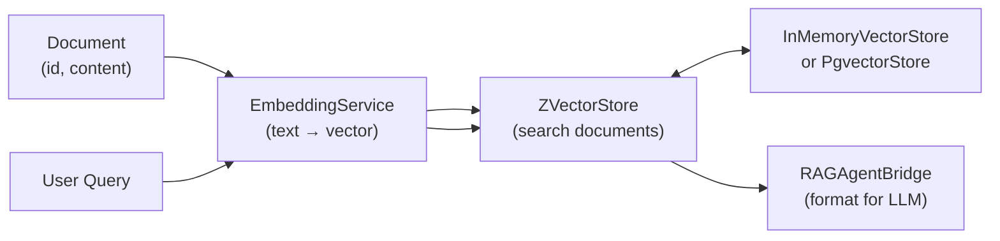

# zio-nn-rag — Retrieval-Augmented Generation Pipeline

**Ingest, embed, store, and query documents for LLM augmentation — built on ZIO.**

```scala
import zio.nn.rag.*
import zio.nn.vectordb.ZVectorStore

// ── Wire the RAG pipeline ──
val pipeline =
  ZLayer.make[RAGService](
    RAGService.live,
    EmbeddingService.layer,
    OpenAIEmbeddingService("sk-..."),
    ZVectorStore.inMemory
  )

// ── Ingest ──
RAGService.ingest(Document("doc-1", "ZIO is a functional effect system for Scala."))

// ── Query ──
val results: Task[Chunk[Document]] =
  RAGService.query("What is ZIO?", topK = 3)
// [doc-1] (score: N/A)
// ZIO is a functional effect system for Scala.
```

## Dependency

```scala
libraryDependencies += "io.github.szekai" %% "zio-nn-rag" % "<version>"   // check latest tag
```

Requires `zio-nn-core` + `zio-nn-vectordb` (auto-pulled as transitive deps).

## Module Contents

| Class / Object | Description |
|---|---|
| `Document` | Case class — `id`, `content`, `metadata`, `embedding` |
| `DocumentStore` | `toVectorRecord` / `fromVectorRecord` conversion + `inMemory` ZLayer |
| `EmbeddingService` | Trait for text → `Array[Float]` embedding |
| `OpenAIEmbeddingService` | OpenAI `/v1/embeddings` client (configurable `baseUrl` for self-hosted providers) |
| `RAGService` / `RAGServiceLive` | Core RAG pipeline: `ingest`, `ingestBatch`, `query`, `deleteDocument` |
| `RAGAgentBridge` / `RAGAgentBridgeLive` | String-returning adapter for AI agent tool calls |

## Pipeline Flow



## ZLayer Wiring

```scala
// In-memory store (testing / single-JVM)
val inMemoryLayer =
  ZLayer.make[RAGService](
    RAGService.live,
    EmbeddingService.layer,
    OpenAIEmbeddingService("sk-..."),
    ZVectorStore.inMemory
  )

// Pgvector store (production)
val pgLayer =
  ZLayer.make[RAGService](
    RAGService.live,
    EmbeddingService.layer,
    OpenAIEmbeddingService("sk-...", baseUrl = "http://localhost:11434/v1"),
    ZVectorStore.pgvector(
      "jdbc:postgresql://localhost:5432/mydb",
      "user", "pass"
    )
  )
```

## Key Features

- **Idempotent re-ingest**: documents with a pre-existing embedding vector skip re-embedding.
- **Backend-agnostic embedding**: swap OpenAI for any OpenAI-compatible endpoint (Ollama, LiteLLM, etc.) via `baseUrl`.
- **Backend-agnostic store**: `InMemoryVectorStore` for dev/test, `PgvectorStore` for production.
- **Agent bridge**: `RAGAgentBridge.search` returns plain-text document blocks for LLM context injection.
